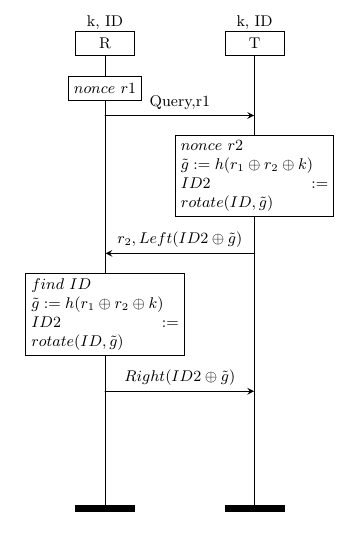
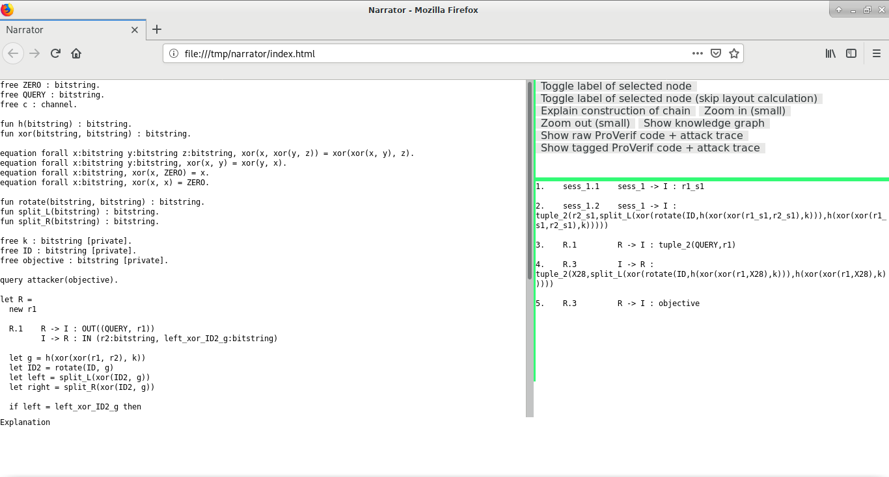
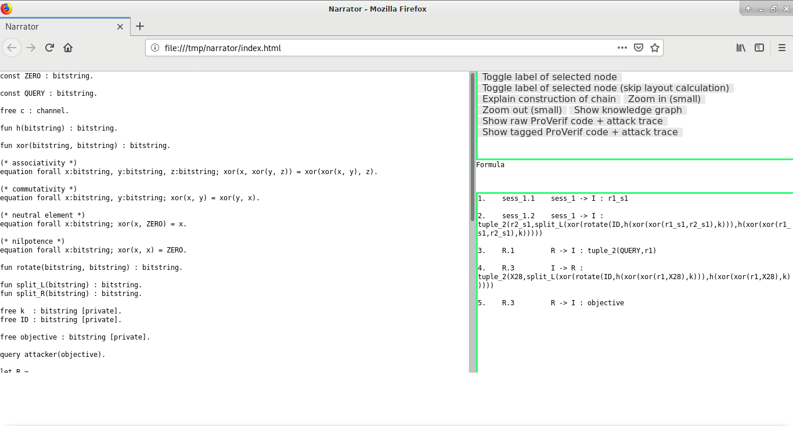
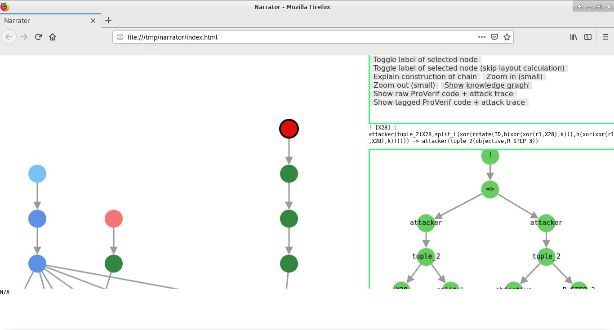
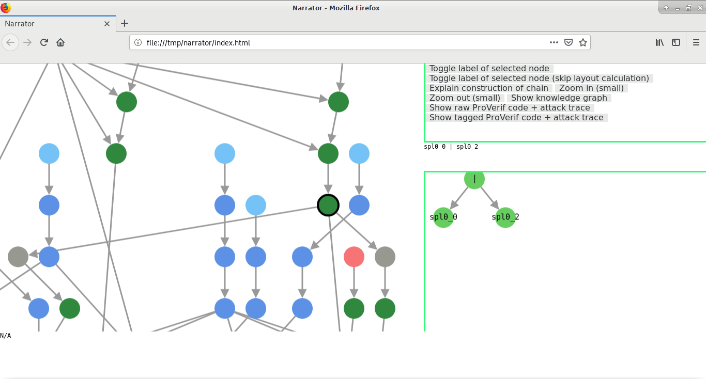
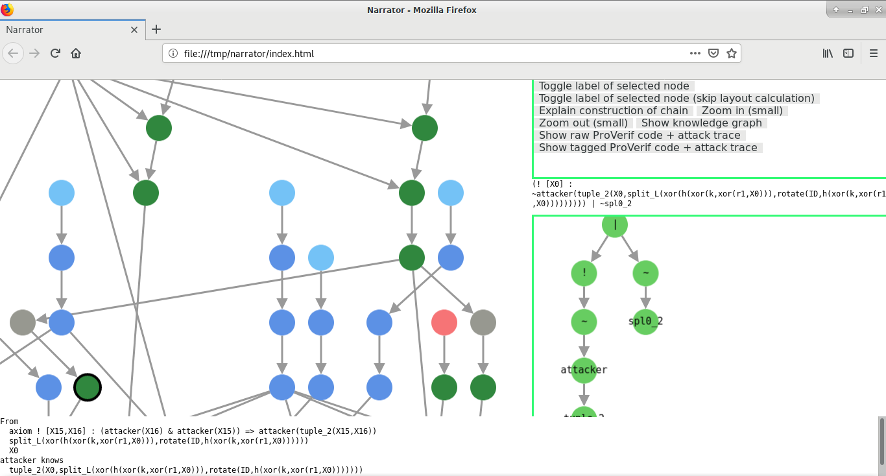
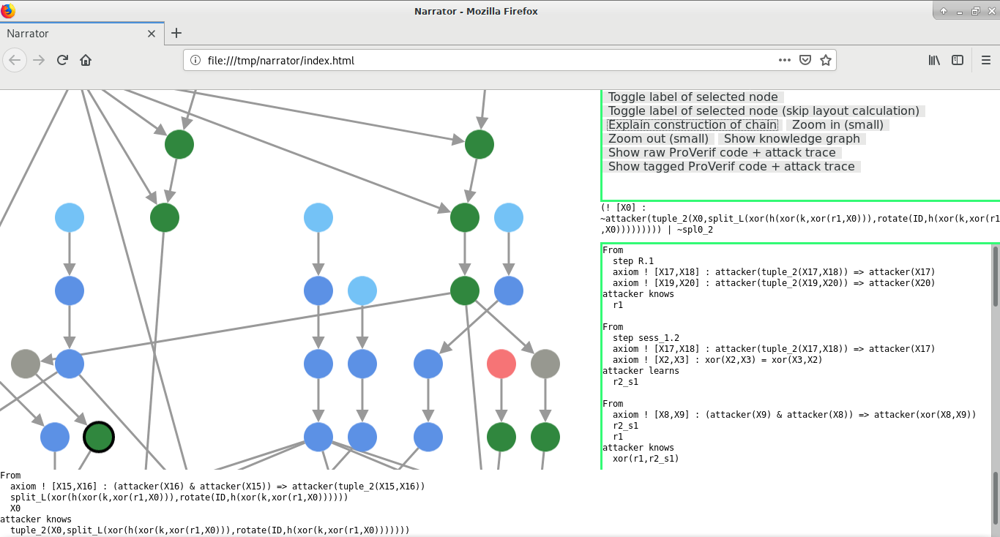

# ProVerif-ATP user manual

pvatp is the main executable that handles the entire workflow

To start, simply type

```bash
pvatp protocol.pv
```

where `protocol.pv` is the protocol ProVerif specification file

Following shows an example that also demonstrates basic navigation in Narrator, see [here](narrator.md) for a more complete guide on using the Narrator interface

## Example

We pick CH07 as our example

We first go through the specification and our encoding, then we'll use pvatp for our analysis

#### CH07 specification

CH07 is a RFID protocol for mutual authentication between a reader and a tag



Above shows the CH07 specification as a message sequence chart, which is a commonly used informal notation for outlining the major protocol steps.

At top left and top right, R and T denotes the RFID reader and the RFID tag respectively. The "k, ID" above them indicates they both share common secrets k, ID prior to the run (execution) of the protocol. k denotes a key and ID denotes an identifier (e.g. serial number).

At the beginning, R generates nonce (randomly generated number that is used only once) r1 then sends it to T

T generates nonce r2, calculates g̃ and ID2, then sends r2 and left half of (ID2 ⊕ g̃) to R.

R finds the ID of T in its database, calculates g̃ and ID2 in the same way, then sends the right half of (ID2 ⊕ g̃) to T

It is implicit that each party verifies the received messages against the calculated ones, and only continue the protocol run if they match up

#### CH07 encoding

We wish to demonstrate CH07 fails to uphold the authentication property of T guaranteed to R if attack has knowledge of a prior session, specifically CH07 fails to uphold the aliveness property of T to R. This means a RFID reader can complete a run of the protocol believing to have been communicating with a legitimate tag, while no tags were present at all. This is also called an impersonation attack - the attacker can impersonate a tag and successfully convince the RFID reader so.

We go through the encoding in individual parts here, see `examples/CH07-tag-auth.pv` for the full encoding file

We first declare the basic primitives (e.g. XOR) and the shared secrets we saw (i.e. k, ID)

```ocaml
const ZERO : bitstring.

const QUERY : bitstring.

free c : channel.

fun h(bitstring) : bitstring.

fun xor(bitstring, bitstring) : bitstring.

(* associativity *)
equation forall x:bitstring, y:bitstring, z:bitstring; xor(x, xor(y, z)) = xor(xor(x, y), z).

(* commutativity *)
equation forall x:bitstring, y:bitstring; xor(x, y) = xor(y, x).

(* neutral element *)
equation forall x:bitstring; xor(x, ZERO) = x.

(* nilpotence *)
equation forall x:bitstring; xor(x, x) = ZERO.

fun rotate(bitstring, bitstring) : bitstring.

fun split_L(bitstring) : bitstring.
fun split_R(bitstring) : bitstring.

free k  : bitstring [private].
free ID : bitstring [private].
```

We then declare "flag" called objective, which only serves to indicate completion of R, and also challenge the attacker to obtain this flag via the `query` construct.

```ocaml
free objective : bitstring [private].

query attacker(objective).
```

We declare R, which is just a straightforward translation of the left side of the message sequence chart. However, we assume R already knows the ID of T, removing the look up step of T's ID in database, to simplify the encoding. Notice the use of objective at the end of R to indicate end of execution.

```ocaml
let R =
  new r1:bitstring;
  out(c, (QUERY, r1));                  (* 1. send r1 R -> T *)
  in(c, (r2             : bitstring,
         left_xor_ID2_g : bitstring));  (* 2. recv left(xor(ID2, g))
                                           T -> R *)
  let g     = h(xor(xor(r1, r2), k)) in
  let ID2   = rotate(ID, g) in
  let left  = split_L(xor(ID2, g)) in
  let right = split_R(xor(ID2, g)) in
  if left = left_xor_ID2_g then (
    out(c, right);                      (* 3. send right(xor(ID2, g))
                                           R -> T *)
    (* authenticated, send out objective *)
    out(c, objective)
  ).
```

Next we encode the prior session, which is just a self-contained simulation. We encoded it this way to avoid attacker interacting with a previous session, complicating the proof. While this technique works well for CH07 and related protocols with similar challenge response structure, it is not restricted to just RFID classes of protocols, and similar encoding can be done for other protocols following the template.

```ocaml
(* simulate 1st session *)
let sess_1 =
  (* run R and T internally once and output all network traffic *)
  new r1_s1:bitstring;
  out(c, r1_s1);
  new r2_s1:bitstring;
  let g_s1     = h(xor(xor(r1_s1, r2_s1), k)) in
  let ID2_s1   = rotate(ID, g_s1) in
  let left_s1  = split_L(xor(ID2_s1, g_s1)) in
  let right_s1 = split_R(xor(ID2_s1, g_s1)) in
  out(c, (r2_s1, left_s1));
  out(c, right_s1).
```

Finally we run both processes concurrently

```ocaml
process
  sess_1 | R
```

Notice we did not encode T, as the attacker is supposed to fill in the role of it.

Overall, the attacker has the information from a previous legitimate session (represented by process sess_1), a RFID reader to interact with (represented by process R), and asked to make R complete execution (i.e. impersonate T).

#### Using pvatp

**Demo site** You can also access the Narrator interface presented below through [here](https://darrenldl.gitlab.io/narrator-ch07), it is the same as the one you get locally through pvatp

To start, just invoke pvatp on the `.pv` file, pvatp handles everything onward automatically as seen by the following sample terminal output

```bash
$ pvatp CH07-tag-auth.pv

ProVerif - Reprint
Reprinted version of your file is stored as :
    CH07-tag-auth.pv.reprinted

ProVerif - Translate to TPTP
Note that certain syntactic modifications are required for the
translation to work, they are done by ProVerif automatically

The processed version of syntax tree is stored as :
    CH07-tag-auth.pv.processed
The TPTP file is stored as :
    CH07-tag-auth.p

Calling Vampire to solve the TPTP file
The output of Vampire is stored as :
    /home/user/ProVerif-ATP/CH07-tag-auth.solver_log
Generating Narrator interface of the output file
Opening Narrator interface in browser
```

#### Interlude - Narrator interface overview

Below shows the Narrator interface opened by pvatp



There are three major modes in Narrator which we will go through one at a time. This initial interface shows the Narrator's **Tagged ProVerif source + attack trace** mode, which displays a prettified and tagged version of the ProVerif source code on left, and the attack trace on bottom right panel.

The tagged version uses same style to annotated input and output steps as the attack trace for easy navigation, but comments and original syntax styles are not preserved.

Top right shows the control panel, the same panel is used for all modes. We can switch to other modes through this panel. By clicking "Show raw ProVerif code + attack trace", we can switch to Narrator's **Raw ProVerif source + attack trace** mode. This displays the raw ProVerif code on left instead of the prettified version as shown below.



This mode is mainly useful when you need to view the actual raw ProVerif code for debugging your specification or if you feel Narrator is incorrect etc.

Finally we click "Show knowledge graph" which invokes the **Knowledge graph** mode as shown below


The knowledge graph display is an interactive display where user may drag, zoom, select node etc. Each node is classified and colour coded accordingly with one of the listed colours


The classifications are detailed in the [complete guide on Narrator interface](narrator.md). We only focus on "protocol step" and "interactive protocol step" in this example.

- Protocol step refers to an unconditional output step, such as step `R.1` (whatever the attacker does, R will send out the nonce r1)

- Interactive protocol step refers to an output step which depends on one or more previous input steps, such as step `R.3 R -> I` which requires attacker to provide the right message at step `R.3 I -> R`

#### Putting everything together

Recall from the attack trace shown in the attack trace mode (copied below)

```ocaml
1.    sess_1.1    sess_1 -> I : r1_s1

2.    sess_1.2    sess_1 -> I : tuple_2(r2_s1,split_L(xor(rotate(ID,h(xor(xor(r1_s1,r2_s1),k))),h(xor(xor(r1_s1,r2_s1),k)))))

3.    R.1         R -> I : tuple_2(QUERY,r1)

4.    R.3         I -> R : tuple_2(X28,split_L(xor(rotate(ID,h(xor(xor(r1,X28),k))),h(xor(xor(r1,X28),k)))))

5.    R.3         R -> I : objective
```

we know step 4 (or step `R.3 I -> R`, which indicates the input step prior to output step 3 in R) is when the attacker provides the message `tuple_2(X28,split_L(xor(rotate(ID,h(xor(xor(r1,X28),k))),h(xor(xor(r1,X28),k)))))` and obtains objective at step 4 (or step `R.3 R -> I`, which indicates the output step 3 in R), where `X28` is a variable (but represents a concrete value, more on that shortly).

Now we wish to know how `tuple_2(X28,split_L(xor(rotate(ID,h(xor(xor(r1,X28),k))),h(xor(xor(r1,X28),k)))))` is constructed.

Notice that this is part of the step `R.3`, which is an interactive step, and thus would appear as a dark red in the knowledge graph. In this example, there is only one dark red node, which is at the top right of the knowledge graph as shown below. The dark red node is selected and highlighted by a black border.

**Side note about node graphics** Selecting a node populates the formula box on right immediately below the control panel, as well as the formula abstract syntax tree (AST) display on bottom right as shown above. Formulas involved in a refutation proof are usually very lengthy, thus we chose to display them separately. If you want them to appear on the node directly, select the nodes and click "Toggle label of selected node" or "Toggle label of selected node (skip layout calculation)". The former will take the space used by the formula text into account and rearrange the graph, the latter will just leave the nodes as they are in current positions (the text may be drawn over other nodes as a result).

We trace downward from the interactive protocol step until we see a green node that branches into two gray nodes.



This branching is introduced by Vampire's AVATAR architecture for utilising SAT or SMT solvers for improved capability. We click on the two gray nodes and we see their respective formulas

```ocaml
spl0_2 <=> ! [X0] : ~attacker(tuple_2(X0,split_L(xor(h(xor(k,xor(r1,X0))),rotate(ID,h(xor(k,xor(r1,X0))))))))

spl0_0 <=> attacker(tuple_2(objective,R_STEP_3))
```

We can see `spl0_2` and `spl0_0` as "aliases" in this example as they are essentially a short name of the two full formulas. We notice the first formula (from the left gray node) carries the message we are interested in figuring how to construct, so we follow it and click on the green node following it shown below.



So obviously if we continue clicking on the connected formulas and observe how they are deconstructed and combined, and their origins, we can reason with what the attacker resembles. However, this is a very tedious process, thus we invoke Narrator's explanation mechanism to automate this for us. Simply click "Explain construction of chain" and the explanation text will appear in the bottom right display, replacing the formula AST.



Below shows the full copy of the text with numbering, where `X0` is same as the `X28` in the attack trace.

```ocaml
(1) From
  step R.1
  axiom ! [X17,X18] : attacker(tuple_2(X17,X18)) => attacker(X17)
  axiom ! [X19,X20] : attacker(tuple_2(X19,X20)) => attacker(X20)
attacker knows
  r1
                                           
(2) From
  step sess_1.2
  axiom ! [X17,X18] : attacker(tuple_2(X17,X18)) => attacker(X17)
  axiom ! [X2,X3] : xor(X2,X3) = xor(X3,X2)
attacker learns
  r2_s1

(3) From
  axiom ! [X8,X9] : (attacker(X9) & attacker(X8)) => attacker(xor(X8,X9))
  r2_s1
  r1
attacker knows
  xor(r1,r2_s1)
                                           
(4) From
  step sess_1.1
  axiom ! [X17,X18] : attacker(tuple_2(X17,X18)) => attacker(X17)
attacker learns
  r1_s1

(5) From
  axiom ! [X2,X3] : xor(X2,X3) = xor(X3,X2)
  axiom ! [X4,X5,X6] : xor(X4,xor(X5,X6)) = xor(xor(X4,X5),X6)
  axiom ! [X8,X9] : (attacker(X9) & attacker(X8)) => attacker(xor(X8,X9))
  r1_s1
  xor(r1,r2_s1)
attacker knows
  xor(r1,xor(r1_s1,r2_s1))
                                           
(6) From
  step sess_1.2
  axiom ! [X17,X18] : attacker(tuple_2(X17,X18)) => attacker(X17)
  axiom ! [X19,X20] : attacker(tuple_2(X19,X20)) => attacker(X20)
  axiom ! [X2,X3] : xor(X2,X3) = xor(X3,X2)
attacker learns
  split_L(xor(h(xor(k,xor(r1_s1,r2_s1))),rotate(ID,h(xor(k,xor(r1_s1,r2_s1))))))

(7) Attacker rewrites
  split_L(xor(h(xor(k,X2)),rotate(ID,h(xor(k,X2)))))
to
  split_L(xor(h(xor(k,xor(r1,X0))),rotate(ID,h(xor(k,xor(r1,X0))))))

  xor(r1,X2)
to
  X0
                                          
(8) From
  axiom ! [X15,X16] : (attacker(X16) & attacker(X15)) => attacker(tuple_2(X15,X16))
  split_L(xor(h(xor(k,xor(r1,X0))),rotate(ID,h(xor(k,xor(r1,X0))))))
  X0
attacker knows
  tuple_2(X0,split_L(xor(h(xor(k,xor(r1,X0))),rotate(ID,h(xor(k,xor(r1,X0)))))))
                                           
```

Lastly, due to the current Narrator's limitations (mentioned in next section), we still need to some manual pattern matching to find out what `X0` is exactly.

Going from bottom to top, we can trace the bindings

```
X0 = xor(r1, X2)                  from (7)
X2 = xor(r1, X0)                  from (7)

X2 = xor(r1_s1,r2_s1)             from (6) and (7)
X0 = xor(r1,xor(r1_s1,r2_s1))     from (6) and (7),
                                  or   (5) and (7)
```

Now we can conclude the message the attacker needs to provide to reader at step `R.3` to impersonate tag is

```ocaml
tuple_2(xor(r1,xor(r1_s1,r2_s1)),
        split_L(xor(rotate(ID,h(xor(xor(r1,xor(r1,xor(r1_s1,r2_s1))),k))),
                    h(xor(xor(r1,xor(r1,xor(r1_s1,r2_s1))),k)))))
```

#### Limitations

- Narrator currently cannot resolve variables (e.g. `X28`, `X0` above) right now as it requires the ATP to explicitly state the unifiers used, but this is not ralways eadily available. Vampire 4.2.2 provides an experimental option `--proof_extra` which exports the unifiers used, but the unifiers are only available in its native output format, not in TPTP output mode.

- We have not implemented an explanation mechanism for deconstruction yet. Explanation of construction is useful to ascertain the message to send when the attack is about satisfying a challenge, but not useful when we want to figure out how a secret is leaked. Thus the counterpart is desirable, which we will introduce in a future version.
